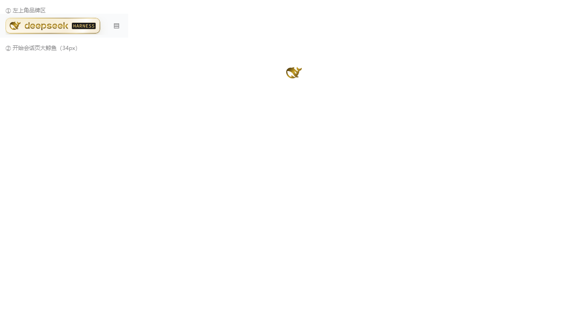
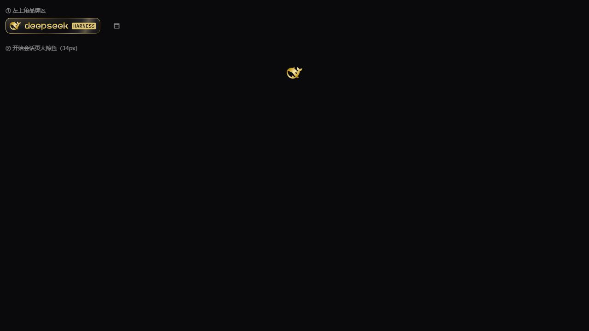

# 黑金 VIP · Black Gold VIP

> 给 DeepSeek Harness（DSH）Web GUI 的**黑金会员卡**主题皮肤。纯 CSS，无 JS，无依赖，装进目录即用。

<p align="center">
  
  
</p>

> **仓库定位**：本仓库是**构建源**（生成器 + 手动安装包）。可安装副本位于上游皮肤仓库
> `zhu1090093659/dsh-skins` 的 `skins/black-gold-vip/`（收录 PR
> [#31](https://github.com/zhu1090093659/dsh-skins/pull/31)），创意工坊
> [dsh-market.com](https://dsh-market.com) 从那里构建一键安装。两处内容一致，改动请同步。

## 它改了什么

| 位置 | 效果 |
| --- | --- |
| 左上角品牌区 | **会员卡**：渐变金属边框 + 卡面打光 + 缓慢掠光；品牌字标与鲸鱼为五档金属金；HARNESS 徽标改为绶带（浅色=黑底金字，深色=金底黑字） |
| 开始会话页大鲸鱼 | 同步金属化（data-URI 蒙版 + CSS 渐变） |
| 其他一切 | **不动**。不声明任何 --dsw-* token，不改布局结构，不替换组件，悬停摆尾动画保留 |

深浅主题自适应：浅色用暖金卡（象牙底 + 深金标），深色用黑金卡（近黑底 + 亮金标）。

## 安装

前置：DSH >= 0.2.0-rc.2，且已装 @linxin666/dsh-client-ui-skin-center（皮肤中心）。

**皮肤是纯资产目录，没有 npm 包、没有安装命令、不需要重启。**

```powershell
# Windows
.\install.ps1
```

```sh
# macOS / Linux
sh ./install.sh
```

然后到 GUI 的 **设置 → 皮肤中心 → 黑金 VIP → 应用**。免重启、实时生效；不想要就切回"官方默认"。

卸载：删掉 `$DSH_HOME/skins/black-gold-vip` 目录。

## 自己改配色

皮肤只有 4 个文件：`skin.json`（清单）、`patches.css`（全部样式）、`skin.css`（故意留空）、`preview/`（预览图）。

配色集中在 `patches.css` 顶部的主题变量（`--vip-flat` / `--vip-metal-*` / `--vip-face` / `--vip-ring` / `--vip-ribbon-*`）。

> ⚠️ 两个踩过的坑
> 1. **自定义属性必须单行写完**：skin-center 会按行处理 CSS，跨行的 `--x: a,` 换行 `b;` 会被截断 → 变量失效（现象：卡片只剩边框、没有底色）。
> 2. 选择器用 `[class*="brandMark"]` 这类**后缀匹配**（CSS Module 哈希前缀会变、后缀稳定）；绶带字母必须用**结构定位** `g[clip-path*="badge-clip"] path`，`path[fill*=...]` 在真实 DOM 上不命中。

## 从源码重建

仓库里带构建脚本，配色不是手写的：

```sh
cd build
npm install
node extract-brand-paths.mjs   # 从本机已安装的 DSH 抽取品牌矢量路径（构建输入，不入库）
node build-skin.mjs            # 用 Chroma.js 生成 ../black-gold-vip 的清单与 CSS
```

`extract-brand-paths.mjs` 必须能找到 `@deepseek-ai/dsh-client-ui-primitives`；找不到时用 `DSH_PRIMITIVES_DIR` 指定其目录。构建产物 `black-gold-vip/patches.css` 与 `skin.json` 直接覆盖发布产物，`preview/*.png` 是手工截图。

## 仓库结构

```
black-gold-vip/     皮肤本体（可分发产物：skin.json + patches.css + skin.css + preview/）
build/              构建脚本（Chroma.js 色板 → 蒙版与 CSS 生成）
install.ps1/.sh     一键装进 $DSH_HOME/skins
CHANGELOG.md        版本记录
THIRD_PARTY_LICENSES.md  品牌图形的 MIT 全文与商标声明
```

## 改动后同步到上游

上游皮肤仓库只收纯资产目录（不含 `build/`），所以改完要推两份，并同步升 `sheet.json` 的 `version`：

```sh
# 1) 重跑构建（在 build/ 里跑 npm run build），产物落在 black-gold-vip/
# 2) 提交并推送本仓库
git add black-gold-vip && git commit -m "feat: ..." && git push
# 3) 同步到上游皮肤仓库并开 PR
cp -r black-gold-vip/. ../dsh-skins-fork/skins/black-gold-vip/
cd ../dsh-skins-fork
node scripts/skin-center-catalog-check.cjs --check   # 必须 PASS
git checkout -b feat/update-black-gold-vip
git add skins/black-gold-vip && git commit -m "feat(skins): update black-gold-vip"
git push origin HEAD
gh pr create --repo zhu1090093659/dsh-skins --base main --head silicon-sbt:feat/update-black-gold-vip
```

## 许可与归属

- 本皮肤的 CSS、构建脚本与文档：**MIT**，Copyright (c) 2026 silicon-sbt（见 `LICENSE`）。
- 品牌图形（鲸鱼 FishLogo 与字标 BrandWordmark 的矢量数据）来自 `@deepseek-ai/dsh-client-ui-primitives`，**MIT License, Copyright (c) 2026 DeepSeek**，许可全文见 `THIRD_PARTY_LICENSES.md`。
- **非官方**：本项目与 DeepSeek 无任何关联、未获其背书；DeepSeek、HARNESS 及相关图形是其各自权利人的商标。
- 皮肤仅通过 CSS 覆盖着色，**不修改 DSH 本体任何文件**，DSH 升级不会丢失。

## 兼容性

依赖 DSH 客户端 CSS Module 的类名后缀（brandMark / brandName / fishHitbox）与插槽结构。DSH 大版本升级若改了这些名字，皮肤会失效（表现为恢复原样，不会破坏界面）。已在 DSH 0.2.0-rc.2 + skin-center 0.4.4 验证浅色/深色、左上角与开始会话页。
